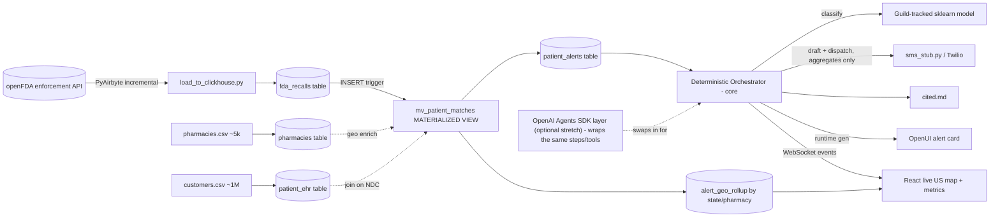
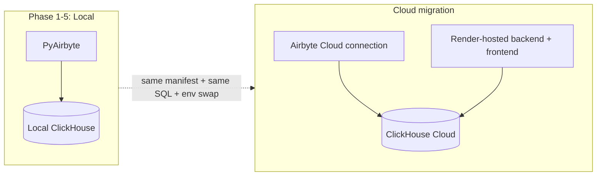

# FDA SafetyNet - Refined Implementation Plan

## Key refinements vs. the original brief

- **"Airbyte Agent SDK" -> PyAirbyte (`pip install airbyte`)** with a **custom declarative YAML source** for `api.fda.gov`, executed via `airbyte.experimental.get_source(name, config, source_manifest=...)`. Incremental sync is configured in the YAML (cursor field `report_date`), and PyAirbyte persists sync **state in its cache** so re-runs skip already-seen records. A thin adapter then loads records into ClickHouse (PyAirbyte has no native ClickHouse cache).
- **Severity labels come for free.** openFDA enforcement records already carry a `classification` field (`Class I/II/III`). We map **Class I -> Lethal, Class II -> Moderate, Class III -> Minor** and use it as ground-truth labels to train the scikit-learn model on the unstructured `reason_for_recall` text. This makes the ML phase a clean supervised problem instead of unlabeled guesswork.
- **OpenUI at runtime + live pipeline view** (per your clarification). A FastAPI backend streams pipeline-stage events over WebSocket to a React dashboard that animates the flow: FDA recall ingested -> received -> ClickHouse match -> severity classified -> pharmacies/customers identified -> alerts dispatched. OpenUI is called at runtime to generate the per-recall alert card markup.
- **Agents are optional (time-boxed decision):** the critical path is a **deterministic orchestrator** doing classify -> draft -> dispatch -> emit events. The OpenAI Agents SDK layer is a **stretch phase** that wraps those same steps using identical tools + event schema, so it can be added at the end (or skipped) with zero rework. This keeps the 4-hour build safe.
- **Local-first, cloud-portable (for sponsor prizes):** to claim Airbyte Cloud / ClickHouse Cloud / Render usage, every external connection (ClickHouse host, Airbyte run mode, LLM, deploy target) is driven by **env/config** from day one. We build + verify locally, then flip a few env vars to run the same code against the cloud services. See the Cloud migration track.
- **NDC matching key:** `openfda.product_ndc` in recalls joined against `prescribed_ndc_code` in the synthetic customer records.
- **National scale (new):** the synthetic dataset models ~5,000 pharmacies across all 50 states and ~1M customer-prescription records (scale is a config knob). A single recall fans out instantly to every affected pharmacy/customer via the ClickHouse MV. The live view is a **US choropleth map** that animates the geographic fan-out (states/pharmacies/customers lit up) plus throughput + end-to-end latency metrics - this is the "works at country scale" proof.
- **Confidentiality (acknowledged, deferred):** pharmacy/customer data is sensitive. We are NOT implementing privacy controls in this build (per your call - added later), but the architecture is privacy-ready: agents reason over de-identified cohort aggregates (severity, region, counts) while the PII-heavy match + dispatch stay in the data layer. See the Confidentiality section for the documented design and future work.

## Architecture & data flow

## Orchestration: deterministic core + optional agent layer

Everything is built around a set of **thin, standalone tools** (plain Python functions). The critical path calls them directly from a deterministic orchestrator; the optional agent layer calls the exact same tools. This is what makes the agents a zero-rework add-on.

Shared tools (used by both core and agents):
- `query_new_matches()` -> reads `patient_alerts` (ClickHouse)
- `classify_severity(text)` -> `phase4_ml/predict.py` (Guild-tracked model; returns `{severity, confidence}`)
- `dispatch_to_cohort(template, cohort_id)` -> re-joins PII inside ClickHouse and fans out to the simulated Twilio webhook (**aggregates-only boundary**: callers pass a message template + cohort id, never raw PII)
- `cite_source(url)` -> appends the openFDA source URL to `cited.md`
- `render_alert_card(context)` -> runtime OpenUI markup (Lethal -> urgent card; Minor -> inventory row); static-template fallback if no `OPENAI_API_KEY`
- shared `events.py` schema published over WebSocket for the live view

### Critical path: deterministic orchestrator (Phase 5)
`orchestrator.py`: on new `patient_alerts`, do `classify_severity` -> build de-identified cohort summary -> draft message (severity-based template) -> `dispatch_to_cohort` -> `cite_source` -> `render_alert_card`, emitting an event at each step. Reliable, fast, no LLM in the loop except the OpenUI card render. This alone is a complete, demoable system.

### Optional stretch: multi-agent layer (Phase 6, only if time allows)
A **supervisor + specialized-worker** pattern (OpenAI Agents SDK) that replaces the orchestrator's procedural steps with reasoning agents over the same tools:
- **Supervisor Agent:** sequences handoffs, emits the same events.
- **Triage Agent:** calls `classify_severity`, then reasons to confirm/override and adds a human-readable `rationale`.
- **Outreach Agent:** reasons over the de-identified cohort summary, drafts a tailored template, calls `dispatch_to_cohort` + `cite_source`.
- **UI Presenter Agent:** wraps `render_alert_card`.

Because the tools and event schema are identical, switching the orchestrator for agents (or running agents behind a feature flag) requires no changes to Phases 1-4 or the frontend.

## Proposed repo structure

- `requirements.txt`, `.env.example`, `README.md`
- `data/pharmacies.csv`, `data/customers.csv` (generated)
- `config/openfda_manifest.yaml` - PyAirbyte declarative source
- `phase1_data/` - `fetch_seed_ndcs.py`, `generate_pharmacies.py`, `generate_customers.py`
- `phase2_ingest/` - `airbyte_source.py`, `load_to_clickhouse.py`
- `phase3_lakehouse/` - `01_create_tables.sql`, `02_materialized_view.sql`, `clickhouse_bootstrap.py`
- `phase4_ml/` - `guild.yml`, `train.py`, `predict.py`
- `phase5_orchestration/` (critical path)
  - `tools/` - `sms_stub.py`, `openui_client.py`, `clickhouse_tools.py`, `cite.py`
  - `events.py` - shared event schema published to the UI
  - `orchestrator.py` - deterministic run loop over the tools
  - `server.py` - FastAPI + WebSocket, serves the React build
  - `frontend/` - React live US map + agent/step trace
- `phase6_agents/` (optional stretch) - `supervisor.py`, `triage_agent.py`, `outreach_agent.py`, `presenter_agent.py` (reuse `phase5_orchestration/tools` + `events.py`)
- `cited.md` (appended at runtime)

## Phase 1 - Environment & synthetic data (national scale)
- `fetch_seed_ndcs.py`: one-time pull of recent recalls (`GET .../drug/enforcement.json?sort=report_date:desc&limit=200`), extract real `openfda.product_ndc` values, write to a seed list. This guarantees demo-time positive matches.
- `generate_pharmacies.py`: ~5,000 synthetic pharmacies with `pharmacy_id`, `name`, `state`, `city`, `zip`, `lat`, `lon`, distributed across all 50 states (weighted by population so the map looks realistic).
- `generate_customers.py`: ~1M customer-prescription records with `customer_id`, `name`, `phone_number`, `pharmacy_id` (FK to a pharmacy, which gives geography), `prescribed_ndc_code`. ~15-20% of NDCs drawn from the real recalled-NDC seed list. **Generated efficiently with numpy/pandas vectorized sampling** (Faker for a small pool of names/phones, then sampled) so 1M rows generate in seconds, not minutes. Scale is a config knob (`SCALE_CUSTOMERS`, default 1,000,000) so we can dial up for the demo.
- Output: `data/pharmacies.csv` and `data/customers.csv` (Parquet optionally for faster ClickHouse load).

## Phase 2 - Ingestion (PyAirbyte)
- `config/openfda_manifest.yaml`: declarative source, stream `drug_enforcement`, base URL `https://api.fda.gov`, path `/drug/enforcement.json`, `DefaultPaginator` over `skip`/`limit` (limit 1000, skip cap 25000), `record_selector` -> `results`, **incremental sync** with `cursor_field: report_date`.
- `airbyte_source.py`: `get_source("source-openfda", config, source_manifest=yaml.safe_load(...))`, `select_streams(["drug_enforcement"])`, `source.read(cache=...)`. State persists in the cache for true incremental re-runs.
- **Cloud-portable:** the same `openfda_manifest.yaml` can be pasted into the **Airbyte Cloud Connector Builder**, so the local PyAirbyte run and a later Airbyte Cloud connection share one source definition (see Cloud migration track).
- `load_to_clickhouse.py`: iterate `read_result["drug_enforcement"]`, flatten the needed fields (`recall_number`, `product_ndc`, `reason_for_recall`, `classification`, `report_date`, `recalling_firm`, source URL), batch-insert via `clickhouse-connect`.

## Phase 3 - Streaming lakehouse (ClickHouse, country-scale)
- Run **clickhouse-server** locally (single binary) so materialized views fire on insert. ClickHouse comfortably handles ~1M+ customer rows + the recall join on a laptop - this is the engine that makes "national scale" credible.
- `01_create_tables.sql`:
  - `fda_recalls` (MergeTree, key `recall_number`)
  - `pharmacies` (MergeTree, key `pharmacy_id`; holds state/city/zip/lat/lon)
  - `patient_ehr` (MergeTree, key `prescribed_ndc_code`; ~1M rows, FK `pharmacy_id`)
  - Optionally load `pharmacies` as a ClickHouse **dictionary** for fast geo enrichment joins.
- `02_materialized_view.sql`:
  - `mv_patient_matches TO patient_alerts`: on insert into `fda_recalls`, join `patient_ehr` on `product_ndc = prescribed_ndc_code` and enrich with pharmacy geography. Each insert auto-emits just the new matches (the high-velocity trigger).
  - `mv_alert_geo_rollup TO alert_geo_rollup`: aggregates matches by `state` / `pharmacy_id` (counts of affected customers/pharmacies) - this powers the live US map and scale metrics without scanning raw PII.
- `clickhouse_bootstrap.py`: apply SQL, bulk-load `pharmacies.csv` then `customers.csv` (batched / native-format insert for speed).
- **Cloud-portable:** all ClickHouse access goes through `clickhouse-connect` configured from env (`CLICKHOUSE_HOST/PORT/USER/PASSWORD/SECURE`). Local server vs. ClickHouse Cloud is purely a config swap; the same SQL/MV scripts run on both (see Cloud migration track).

## Phase 4 - ML severity classification (Guild.ai + scikit-learn)
- `train.py`: pull recall rows from ClickHouse; features = TF-IDF of `reason_for_recall`, labels = mapped `classification`. Pipeline `TfidfVectorizer -> TruncatedSVD -> LogisticRegression`. The **TruncatedSVD step decorrelates the vectorized text features** (the requested multicollinearity mitigation), with a logged feature-correlation summary as evidence. Flags: `max_features`, `ngram_max`, `svd_components`, `C`.
- `guild.yml`: defines the `train` operation and flags so `guild run train ...` and **`guild compare`** show multiple tuned runs for the judges.
- `predict.py`: load the chosen model artifact, expose `classify(reason_text) -> {Lethal|Moderate|Minor, confidence}` for the orchestrator (falls back to raw `classification` if the model is unavailable).

## Phase 5 - Orchestration & UI (deterministic core: FastAPI + OpenUI + React)
- `tools/`: implement the thin function tools first (`sms_stub.py`, `openui_client.py`, `clickhouse_tools.py`, `cite.py`) - each standalone-testable.
- `events.py`: the step-event schema published over WebSocket.
- `orchestrator.py`: deterministic loop - on new `patient_alerts`, `classify_severity` -> build de-identified cohort summary -> draft severity-based message template -> `dispatch_to_cohort` -> `cite_source` -> `render_alert_card`, emitting an event per step. No agent framework, fully reliable.
- `server.py` (FastAPI): WebSocket `/stream` broadcasting step events; REST to kick off a sync + orchestrator run; serves the React build.
- `openui_client.py`: runtime call to OpenUI (OpenAI backend, via `OPENAI_API_KEY`) returning alert-card JSX/HTML. **Lethal** -> high-contrast urgent card; **Minor** -> filterable inventory row. Static-template fallback if no key.
- `sms_stub.py`: simulated Twilio webhook (logs payload, no real send).
- `frontend/`: React "live system" view with a **US choropleth map** (e.g., `react-simple-maps` / D3) animating geographic fan-out as states/pharmacies light up, alongside the step flow (match found -> severity decided -> drafting -> dispatched -> card rendered). Live scale counters: recalls processed, pharmacies impacted, states affected, customers alerted, end-to-end latency. Plus the rendered OpenUI alert cards.

## Phase 6 - Multi-agent layer (OPTIONAL stretch, only if time remains)
- Build only after Phases 1-5 are green and demo-ready. Reuses `phase5_orchestration/tools` + `events.py` unchanged.
- `phase6_agents/{triage,outreach,presenter}_agent.py`: define each as an OpenAI Agents SDK agent with instructions + the shared tools.
- `phase6_agents/supervisor.py`: supervisor agent that polls matches and hands off Triage -> Outreach -> Presenter, emitting the same events.
- Wire behind a feature flag (e.g., `USE_AGENTS=true`) so `server.py` runs either the deterministic orchestrator or the agent supervisor. Demo can show both; if time runs out, ship the deterministic core.

## National scale & confidentiality

### Scale (implemented this build)
- Synthetic dataset: **~5,000 pharmacies across 50 states + ~1M customer-prescription rows** (config-knobbed via `SCALE_CUSTOMERS`).
- ClickHouse performs the recall->customer join and geo rollup over the full dataset in sub-second to low-second range, demonstrating that one recall fans out nationwide instantly.
- The demo shows hard scale metrics: # pharmacies impacted, # states, # customers alerted, rows/sec throughput, and end-to-end latency from "recall ingested" to "cohort dispatched".

### Confidentiality (acknowledged, NOT implemented this build - future work)
Per your direction we are not building privacy controls now, but the design is privacy-ready so they slot in later without rework:
- **PII never enters LLM/agent prompts** - the orchestrator (and optional agents) operate on de-identified cohort aggregates; `dispatch_to_cohort` re-joins PII inside the data layer at send time. (This boundary is honored in the build because it's essentially free and improves the architecture.)
- Deferred for later: pseudonymized/hashed `customer_id`, encryption-at-rest, role-based access control on the pharmacy store, audit logging, and consent/opt-out handling.
- `cited.md` only ever contains public openFDA source URLs - never customer data.

## Sponsor prize integrations (POST-MVP sprinkles - do not block the MVP)

Priority is a working MVP (Phases 1-5). These are optional add-ons layered on afterward to claim sponsor prizes, ordered by ROI (effort vs. payoff). Each is independent and can be skipped.

### Already covered by the core plan
- **Guild.ai** (Most Innovative Use of Agents) - Phase 4 model tracking + `guild compare`; if we reach Phase 6, track agent runs too.
- **OpenUI** (Best Use of OpenUI) - Phase 5 runtime alert cards.
- **ClickHouse** (Best Use of ClickHouse) - Phase 3 lakehouse + materialized views at 1M+ scale.
- **Airbyte** (broad usage) - Phase 2 PyAirbyte ingestion. NOTE: see the Airbyte Agent Engine caveat below re: the *specific* prize.

### Add-ons, best ROI first
1. **Render** (Best Use of Render) - ~30 min. Deploy the FastAPI backend + React frontend to Render for a live public demo URL (great for judging too). Slots in right after Phase 5. Lowest risk, highest visibility.
2. **Senso.ai** (Best use of Senso.ai + thematically "Conquer with Context") - ~45 min. STRONGEST fit: Senso is a verified ground-truth/context layer and literally runs `cited.md`, which our plan already produces. Use `POST /org/kb/upload` (`https://apiv2.senso.ai/api/v1`, `X-API-Key`) to ingest openFDA recall sources as verified knowledge, and `POST /org/search/context` to fetch grounded recall context during severity/outreach reasoning - replacing/augmenting the local `cited.md`. $100 free credits.
3. **Composio** (Best Agent Execution) - ~45 min, only if we do Phase 6. Replace `sms_stub` with Composio's Twilio toolkit via the `composio_openai_agents` provider so the Outreach agent *actually executes* the SMS send with managed auth: `session = composio.create(user_id=...)`, `session.tools(toolkits=["twilio"])`. Directly targets the "agent execution" prize. Needs `COMPOSIO_API_KEY`.
4. **Truefoundry** (Best Use of Truefoundry) - ~45-60 min. Either (a) deploy the Phase 4 severity classifier as a model endpoint on TrueFoundry and have `predict.py` call it, or (b) route OpenAI/OpenUI/agent calls through TrueFoundry's AI Gateway for observability + a single managed key. Either claims usage.
5. **Airbyte Agent Engine** (Conquer with Context: Best Use of Airbyte's Agent Engine) - CAVEAT: this prize targets Airbyte's newer **Agents / Context Store** product (`mcp.airbyte.ai`, Agent SDK), which is built around SaaS connectors (Salesforce/Stripe/etc.) and is distinct from the PyAirbyte ingestion we use in Phase 2. To specifically chase this prize we'd wire the Airbyte Agent SDK/MCP as a context source for the Phase 6 agents - but the fit for a public-API + ClickHouse pipeline is weak. Recommendation: rely on Phase 2 PyAirbyte for general Airbyte usage; only pursue the Agent Engine prize if organizers confirm PyAirbyte/our approach qualifies.

### Skipped
- **Pioneer** (Best Use of Pioneer) - SKIPPED per decision (product unclear; `pioneer.app` is a defunct accelerator). Not pursuing.

## Cloud migration track (local-first -> cloud for prizes)

We build and verify everything locally, then migrate to the cloud services so we can demonstrate real cloud usage for the prizes. Because all connections are env-driven, migration is mostly configuration. Do this AFTER the local MVP is green.

### ClickHouse Cloud (Best Use of ClickHouse)
- Create a ClickHouse Cloud service; copy host/port/password.
- Set `CLICKHOUSE_HOST=...`, `CLICKHOUSE_SECURE=true`, etc. in `.env`. Re-run `clickhouse_bootstrap.py` (same SQL + MVs) against Cloud, then load the data. No code changes.
- Verify the same recall->customer match + geo rollup run on Cloud.

### Airbyte Cloud (Best Use of Airbyte)
- In Airbyte Cloud, recreate the openFDA source via the **Connector Builder** using our `openfda_manifest.yaml` (same declarative definition).
- Add a **ClickHouse destination** pointing at the ClickHouse Cloud service; create a connection (openFDA -> ClickHouse Cloud) with incremental sync, and run it from the Cloud UI. This replaces the local PyAirbyte run with a genuine Airbyte Cloud sync.
- Our app then reads from ClickHouse Cloud as usual.

### Render (Best Use of Render)
- Deploy the FastAPI backend + React frontend to Render (env points at ClickHouse Cloud + OpenAI). Gives a live public demo URL.

### Already cloud (no migration needed)
- OpenAI, OpenUI (hosted/W&B), Composio, Senso.ai, Truefoundry are SaaS - using them = cloud usage already.

### Trade-offs / notes
- ClickHouse Cloud materialized views behave the same; just ensure the destination tables exist before the MV (bootstrap order preserved).
- Airbyte Cloud's ClickHouse destination writes raw tables; keep the MV/rollup as ClickHouse-side objects we create via `clickhouse_bootstrap.py` (independent of how rows arrive).
- Keep the local path working as a fallback for the live demo in case of cloud/network issues.

### Optional env keys for these add-ons
`COMPOSIO_API_KEY`, `SENSO_API_KEY`, `TRUEFOUNDRY_API_KEY` (+ a Render account, and Airbyte Agents key if pursued). All optional; absence just disables that one integration.

## What I need from YOU (manual setup checklist)

Nothing here is strictly required to get a working demo (every item has a fallback noted below), but providing them unlocks the full-fidelity version.

### API keys / accounts
- [ ] **`OPENAI_API_KEY`** (recommended) - powers **OpenUI** runtime card generation and, if we reach the optional Phase 6, the **OpenAI Agents SDK** agents. Fallback if missing: `openui_client.py` uses a static JSX template, so the deterministic core demo still runs fully.
- [ ] **`OPENFDA_API_KEY`** (OPTIONAL) - get free at https://open.fda.gov/apis/authentication/. Raises rate limit from 240 req/min to 120k/day. Fallback: works key-less for demo volumes.
- [ ] **Twilio credentials** - NOT needed; SMS dispatch is simulated/logged per the brief. Only needed if you later want real texts (`TWILIO_ACCOUNT_SID`, `TWILIO_AUTH_TOKEN`, `TWILIO_FROM_NUMBER`).
- [ ] **Guild.ai** - no account/key needed; it tracks runs locally on disk.

### Infrastructure to provision/approve (I'll request access before installing)
- [ ] **ClickHouse server running locally** - I install the single binary and run `clickhouse server`. Needs an open local port (default 9000/8123) and ~disk for data. Confirm I may install + run a background server process.
- [ ] **Node.js + npm** (for the React `frontend/`). Confirm installed, or approve install.
- [ ] **Python 3.10+ virtualenv** with network access to install pip packages (PyAirbyte pulls connector deps at runtime).
- [ ] **Outbound network access** to `api.fda.gov` and the chosen LLM endpoint from this machine.

### Decisions you may want to make (I'll default if you don't)
- [ ] LLM provider: **OpenAI (decided)** via `OPENAI_API_KEY`; static fallback if the key is absent.
- [ ] Demo ingestion window (default: most recent ~1,000 recalls so the live trace finishes quickly).
- [ ] Scale knobs (defaults: ~5,000 pharmacies, ~1M customers; dial up for the demo via `SCALE_CUSTOMERS`).
- [ ] Customer NDC overlap rate (default: ~15-20% of customers on recalled NDCs).

### Cloud accounts (needed for the cloud-migration track / prizes, NOT for the local MVP)
- [ ] **ClickHouse Cloud** service (host/password) - for Best Use of ClickHouse on cloud.
- [ ] **Airbyte Cloud** account - to recreate the source + ClickHouse destination connection.
- [ ] **Render** account - to host the backend + frontend.
- [ ] (SaaS sponsors above already cover their own cloud: Composio, Senso.ai, Truefoundry, OpenAI.)
- These are only required when we migrate; the local MVP needs none of them.

### What you do NOT need to provide
- No real pharmacy or customer data - the entire ~5k-pharmacy / ~1M-customer dataset is synthetic.
- No cloud accounts for the LOCAL MVP - everything runs on your machine until the cloud-migration track.

### Where these go
All keys/config land in a single `.env` (template provided as `.env.example`); I will never commit `.env`.

## Assumptions & dependencies needing approval (per your "Ask for Permissions" rule)
- I will **pause to request environment access** before installing: `airbyte` (PyAirbyte), the **clickhouse-server binary**, `clickhouse-connect`, `numpy`/`pandas`/`pyarrow` (fast 1M-row generation + load), `scikit-learn`, `guildai`, `openai`, `fastapi`/`uvicorn`, `faker`, and the React/Node toolchain (incl. a map lib like `react-simple-maps`). `openai-agents` (OpenAI Agents SDK) is installed only if we reach the optional Phase 6.
- **OpenUI runtime** uses the **OpenAI** backend via `OPENAI_API_KEY` in `.env`; if absent, `openui_client.py` falls back to a static template so the demo never breaks.
- openFDA works key-less but is rate-limited; an optional `OPENFDA_API_KEY` raises limits.
- Twilio is **simulated only** (no real SMS), per the brief.

## Incremental build & verification strategy

We build **step by step and verify each part before moving on**. No formal unit-test suite is required, but every phase ends with a concrete, observable verification (a command + expected output) so we never stack work on an unverified layer. I'll pause at each checkpoint to confirm green before proceeding.

Build order: **Phase 1 -> Phase 3 (tables) -> Phase 2 (ingest) -> Phase 4 (ML) -> Phase 5 (deterministic orchestration + UI)**, since each layer feeds the next. Phase 5 frontend scaffolding can proceed in parallel once events are defined. **Phase 6 (agents) is optional and only attempted after Phase 5 is demo-ready.**

### Verification checkpoints
- **Phase 1:** Run generators -> `pharmacies.csv` has ~5,000 rows spanning 50 states; `customers.csv` has ~1M rows with valid NDC format, every `pharmacy_id` resolves to a pharmacy, and a non-zero count of NDCs are in the real recalled-seed list (print overlap count + per-state distribution). Verify generation completes in seconds.
- **Phase 3:** Run `clickhouse_bootstrap.py` -> `SELECT count() FROM patient_ehr` ~= 1M and `FROM pharmacies` ~= 5k; `SHOW TABLES` lists all tables + `mv_patient_matches`, `mv_alert_geo_rollup`. Manual smoke: insert one fake recall whose NDC matches customers -> confirm rows auto-appear in `patient_alerts` AND `alert_geo_rollup` shows per-state counts (proves the MV trigger + geo rollup fire). Time a real recall join to confirm sub-second/low-second latency at 1M scale.
- **Phase 2:** Run `airbyte_source.py` once -> prints record count read from openFDA; `load_to_clickhouse.py` -> `SELECT count() FROM fda_recalls` > 0. Re-run -> count of NEW rows is ~0 (proves incremental state works). Confirm real recall NDCs landed and `patient_alerts` now has real matches.
- **Phase 4:** `guild run train` for 3-4 flag combos -> `guild compare` shows multiple runs with accuracy/F1 columns (screenshot-ready). `predict.classify("...reason text...")` returns a sane `{Lethal|Moderate|Minor, confidence}`. Spot-check a few known Class I reasons map to Lethal.
- **Phase 5 (incremental sub-steps):**
  1. Tools standalone: `sms_stub.py` logs a formatted payload; `openui_client.py` returns valid markup for Lethal + Minor (and falls back cleanly with no key); `clickhouse_tools.query_new_matches()` returns rows; `dispatch_to_cohort` fans out using only template + cohort id.
  2. `server.py` WebSocket -> a test client receives the ordered step-event sequence.
  3. Full `orchestrator.py` run -> end-to-end: real match -> severity decided -> message drafted + cohort dispatched (SMS stub logged) -> `cited.md` appended with the openFDA source URL -> card rendered -> UI map lights up affected states with live scale counts (pharmacies/states/customers) and latency.
- **Phase 6 (optional):** with `USE_AGENTS=true`, the supervisor produces the same end-to-end event sequence as the orchestrator, plus a Triage `rationale`. Verify it matches the deterministic baseline.

### Definition of done (demo-ready)
A single launch script starts ClickHouse + backend + frontend; triggering a sync makes the live US map + step trace animate a real recall flowing through ingest -> nationwide match -> severity -> cohort identification -> dispatch, showing thousands of pharmacies / multiple states / many customers alerted in seconds, with `guild compare` and `cited.md` available as MLOps/ground-truth evidence. The optional Phase 6 agent layer is a bonus, not a requirement for "done".