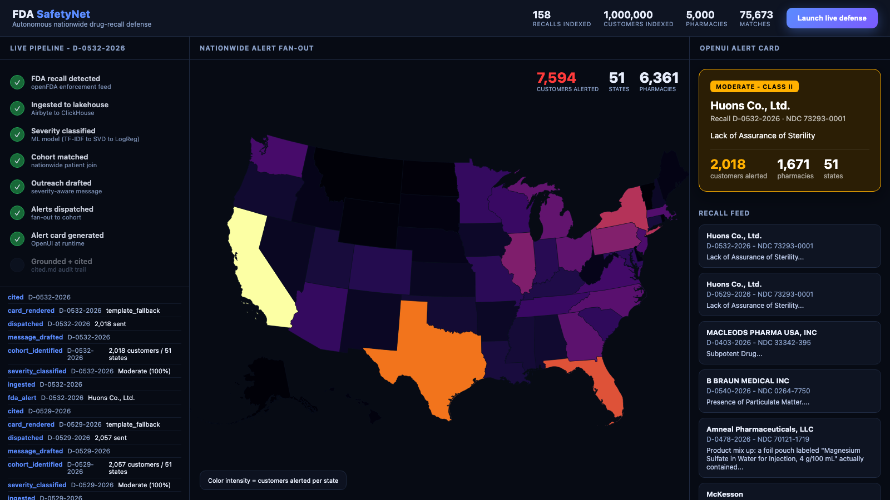

# FDA SafetyNet

**Autonomous, nationwide consumer-defense shield for FDA drug recalls.**

SafetyNet ingests real-time FDA drug-recall data, matches it against a
national-scale synthetic pharmacy/patient database (5,000 pharmacies, 1,000,000
customers across all 50 states + DC), classifies severity with an ML model, and
automatically fans out emergency alerts - visualized as a live US map.



---

## Architecture

```
openFDA enforcement API
        │  (PyAirbyte declarative connector, incremental)
        ▼
   fda_recalls ──┐
                 │  ClickHouse Materialized View (real-time trigger)
   patient_ehr ──┤────────────►  patient_alerts ──► alert_geo_rollup (per-state, no PII)
   pharmacies ───┘
        ▲                                  │
        │ Phase 1 synthetic data           ▼
                                    Deterministic Orchestrator (Phase 5)
                                    ├─ ML severity model (Phase 4, Guild-tracked)
                                    ├─ cohort match (de-identified aggregates)
                                    ├─ simulated dispatch (sms_stub)
                                    ├─ OpenUI runtime alert cards
                                    └─ cited.md grounded audit trail
                                            │  events
                                            ▼
                            FastAPI + WebSocket  ──►  React live US map + trace
```

Confidentiality by design: the orchestrator only ever sees de-identified
aggregates. PII (names, phone numbers) is re-associated only inside the
data-layer dispatch tool and never enters any LLM prompt.

---

## Prerequisites

- Python 3.12 (`python3.12`)
- ClickHouse (local binary, installed below)
- Node/Chrome only needed for optional screenshotting

## One-time setup

```bash
# 1. Main venv (ingestion, ML inference, orchestration, API)
python3.12 -m venv .venv
.venv/bin/pip install -r requirements.txt

# 2. Isolated venv for Guild AI training (pins protobuf<5, conflicts with PyAirbyte)
python3.12 -m venv .venv-guild
.venv-guild/bin/pip install guildai scikit-learn==1.9.0 scipy joblib pandas numpy clickhouse-connect python-dotenv "setuptools<81"

# 3. ClickHouse (single local binary)
curl https://clickhouse.com/ | sh

# 4. Env config
cp .env.example .env   # add OPENAI_API_KEY to enable runtime OpenUI cards
```

> Note: Guild AI 0.9.0 needs an `imp` shim on Python 3.12 (auto-created in the
> guild venv site-packages). See `.venv-guild/.../imp.py`.

## Run the full pipeline

```bash
# Start ClickHouse server (keep running)
./clickhouse server -C phase3_lakehouse/clickhouse-config.xml

# --- Phase 1: synthetic national-scale data ---
.venv/bin/python phase1_data/fetch_seed_ndcs.py
.venv/bin/python phase1_data/generate_pharmacies.py
.venv/bin/python phase1_data/generate_customers.py
.venv/bin/python phase1_data/verify_data.py

# --- Phase 3: lakehouse schema + load ---
.venv/bin/python phase3_lakehouse/clickhouse_bootstrap.py
.venv/bin/python phase3_lakehouse/verify_clickhouse.py   # proves MV trigger at 1M scale

# --- Phase 2: ingest real openFDA recalls (fires the matching MV) ---
.venv/bin/python phase2_ingest/load_to_clickhouse.py

# --- Phase 4: train + track the severity model ---
.venv/bin/python phase4_ml/prepare_training_data.py
SAFETYNET_ROOT=$(pwd) .venv-guild/bin/python phase4_ml/train.py --max_features 8000 --svd_components 200 --C 2.0 --save_canonical
# hyperparameter sweep + comparison:
cd phase4_ml && GUILD_HOME="$(cd .. && pwd)/.guild" SAFETYNET_ROOT="$(cd .. && pwd)" ../.venv-guild/bin/guild run severity:train max_features=5000 svd_components=120 -y
../.venv-guild/bin/guild compare; cd ..

# --- Phase 5: launch the live dashboard ---
.venv/bin/uvicorn phase5_orchestration.server:app --host 127.0.0.1 --port 8000
# open http://127.0.0.1:8000  ->  click "Launch live defense"
```

## What each phase proves

| Phase | Component | Verification |
|-------|-----------|--------------|
| 1 | National-scale synthetic data | `verify_data.py`: 51 states, 1M rows, 180k recalled-NDC overlaps |
| 2 | PyAirbyte declarative openFDA connector | incremental: 2nd load inserts 0 new (idempotent) |
| 3 | ClickHouse streaming lakehouse + MV | 1 recall insert -> auto fan-out to matched cohort in <0.3s |
| 4 | ML severity classifier (Guild-tracked) | 0.79 acc / 0.79 F1; SVD cuts feature correlation 0.12 -> 0.001 |
| 5 | Orchestrator + live UI | WebSocket trace, US choropleth, OpenUI cards, cited.md |

## Tech stack

PyAirbyte (declarative YAML) · ClickHouse (materialized views) · scikit-learn ·
Guild AI · FastAPI · React + d3-geo · OpenAI (OpenUI runtime cards).

## Optional / stretch (not yet built)

- Phase 6: OpenAI Agents SDK supervisor + workers behind `USE_AGENTS=true`
- Phase 7: sponsor integrations (Render, Senso.ai, Composio, Truefoundry)
- Phase 8: cloud migration (ClickHouse Cloud, Airbyte Cloud, Render)
